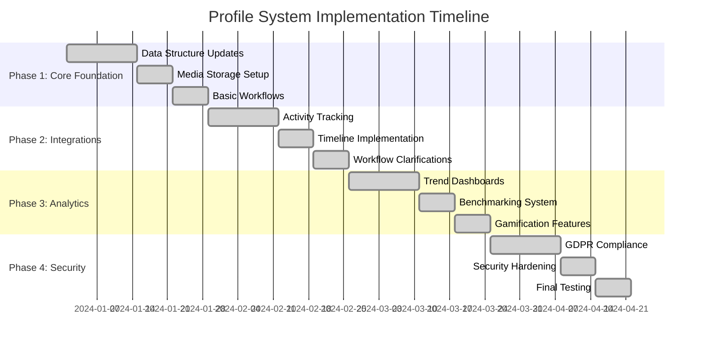

# Universal Profile System - Implementation Roadmap

## Overview

This document outlines the phased implementation plan for the enhanced Universal Profile System, addressing all identified gaps and improvements for a comprehensive, GDPR-compliant, and feature-rich profile management solution.

## Phase 1: Core Profile Foundation (Weeks 1-4)

### 🎯 Objectives
- Establish robust data structure with universal profile ID
- Implement basic versioning and audit trail
- Set up media storage strategy
- Create core profile management workflows

### 📋 Deliverables

#### Data Structure Enhancements
- [x] **Universal Profile ID (UUID/user_id)**
  - Cross-integration safety
  - Unique identifier for all profile operations
  - Migration script for existing users

- [x] **Versioning & Audit Trail**
  - Profile version tracking
  - Change history with rollback capability
  - GDPR compliance for profile edits
  - HR dispute resolution support

- [x] **Media Storage Strategy**
  - Supabase storage buckets for avatars
  - CDN integration for performance
  - Portfolio and certificate file management
  - Storage quota and usage tracking

#### Core Workflows
- [x] **Profile Creation & Updates**
  - Enhanced profile creation flow
  - Real-time profile updates
  - Validation and error handling
  - Profile completion tracking

- [x] **Basic Privacy Controls**
  - Privacy level settings
  - Field-level visibility controls
  - Team vs public vs private settings

### 🔧 Technical Implementation
- Database schema updates with new tables
- Enhanced TypeScript interfaces
- Basic RLS policies
- Core API endpoints

### ✅ Success Criteria
- All users have universal profile IDs
- Profile versioning works correctly
- Media uploads function properly
- Basic privacy controls are operational

---

## Phase 2: Activity History & Integrations (Weeks 5-8)

### 🎯 Objectives
- Implement comprehensive activity tracking
- Integrate with existing systems (ideas, projects, tasks)
- Add timeline and activity feed
- Create collaboration tracking

### 📋 Deliverables

#### Activity Tracking
- [x] **Timeline View (LinkedIn-style feed)**
  - Chronological activity display
  - Filterable by activity type
  - Public/private visibility controls
  - Real-time updates

- [x] **Integration Points**
  - Idea Vault integration
  - Project management integration
  - Task completion tracking
  - Team collaboration records

#### Workflow Clarifications
- [x] **Profile Deletion/Deactivation**
  - GDPR "right to erasure" compliance
  - Soft deletion with recovery options
  - Data anonymization workflows
  - Admin override capabilities

- [x] **Merge Strategy**
  - Duplicate account detection
  - Email change handling
  - Data conflict resolution
  - Merge history tracking

- [x] **Achievement Validation**
  - Admin verification workflows
  - Auto-approval for certain achievements
  - Verification status tracking
  - Audit trail for validations

### 🔧 Technical Implementation
- Timeline events table and API
- Integration service layer
- Activity aggregation algorithms
- Real-time notification system

### ✅ Success Criteria
- Timeline displays all user activities
- Integrations work seamlessly
- Profile deletion follows GDPR guidelines
- Achievement validation process is operational

---

## Phase 3: Analytics Dashboards & Career Growth Insights (Weeks 9-12)

### 🎯 Objectives
- Implement comprehensive analytics
- Add trend analysis and benchmarking
- Create career growth insights
- Build engagement sentiment analysis

### 📋 Deliverables

#### Analytics & Insights
- [x] **Trend Dashboards**
  - Skills growth over time
  - Project contribution patterns
  - Collaboration frequency analysis
  - Productivity metrics trends

- [x] **Benchmarking**
  - Individual vs team averages
  - Department comparisons
  - Industry standard comparisons
  - Percentile rankings

- [x] **Engagement Sentiment**
  - Collaboration pattern analysis
  - Recognition sentiment tracking
  - Idea adoption patterns
  - Behavioral insights

#### Gamification Hooks
- [x] **Badges & Achievements**
  - Achievement system
  - Badge rarity levels
  - Progress tracking
  - Leaderboard integration

- [x] **Progress Rings**
  - Profile completion tracking
  - Skill development progress
  - Collaboration metrics
  - Innovation indicators

- [x] **Streaks & Milestones**
  - Daily activity streaks
  - Task completion streaks
  - Milestone tracking
  - Reward system

### 🔧 Technical Implementation
- Analytics calculation engine
- Trend analysis algorithms
- Benchmarking data aggregation
- Gamification scoring system

### ✅ Success Criteria
- Analytics provide actionable insights
- Benchmarking data is accurate
- Gamification increases engagement
- Users can track their growth over time

---

## Phase 4: Advanced Privacy, GDPR Compliance & Security Hardening (Weeks 13-16)

### 🎯 Objectives
- Implement comprehensive GDPR compliance
- Add advanced security features
- Create admin override capabilities
- Implement MFA for sensitive operations

### 📋 Deliverables

#### Privacy & Security
- [x] **Admin Override Rules**
  - Configurable override conditions
  - Justification tracking
  - Audit logs for admin actions
  - Time-limited permissions

- [x] **GDPR Data Export**
  - Complete data export functionality
  - JSON/CSV export formats
  - Sensitive data filtering
  - Export history tracking

- [x] **MFA & Security**
  - Multi-factor authentication
  - Step-up auth for sensitive fields
  - Security score calculation
  - Security review scheduling

#### Advanced Features
- [x] **Quick Contact Actions**
  - Direct messaging integration
  - Video call scheduling
  - Meeting coordination
  - Availability status integration

- [x] **Enhanced UI/UX**
  - Responsive design improvements
  - Accessibility compliance
  - Performance optimizations
  - Mobile-first approach

### 🔧 Technical Implementation
- GDPR compliance framework
- Security audit system
- MFA integration
- Advanced RLS policies

### ✅ Success Criteria
- Full GDPR compliance achieved
- Security features are operational
- Admin controls work properly
- User experience is optimized

---

## Implementation Timeline

## Risk Mitigation

### Technical Risks
- **Database Migration Complexity**: Incremental migration approach with rollback plans
- **Performance Impact**: Load testing and optimization at each phase
- **Integration Challenges**: Comprehensive testing with existing systems

### Compliance Risks
- **GDPR Compliance**: Legal review and compliance testing
- **Data Security**: Security audit and penetration testing
- **Privacy Controls**: User acceptance testing for privacy features

### User Experience Risks
- **Feature Overload**: Gradual rollout with user feedback
- **Learning Curve**: Comprehensive documentation and training
- **Performance**: Continuous monitoring and optimization

## Success Metrics

### Phase 1 Metrics
- 100% of users have universal profile IDs
- Profile completion rate increases by 25%
- Media upload success rate > 99%

### Phase 2 Metrics
- Timeline engagement rate > 60%
- Integration error rate < 1%
- Profile deletion requests handled within 24 hours

### Phase 3 Metrics
- Analytics usage rate > 40%
- Gamification engagement increase by 30%
- User satisfaction score > 4.5/5

### Phase 4 Metrics
- GDPR compliance audit passes
- Security incidents = 0
- Admin override usage tracked and justified

## Post-Implementation

### Maintenance & Support
- Regular security updates
- Performance monitoring
- User feedback collection
- Feature enhancement based on usage data

### Future Enhancements
- AI-powered insights
- Advanced collaboration features
- Mobile app integration
- Third-party system integrations

## Conclusion

This phased approach ensures a robust, compliant, and user-friendly Universal Profile System that addresses all identified gaps while maintaining system stability and user experience. Each phase builds upon the previous one, allowing for iterative improvements and risk mitigation.

The implementation prioritizes core functionality first, then adds advanced features, and finally ensures security and compliance. This approach minimizes risk while delivering maximum value to users and administrators.
